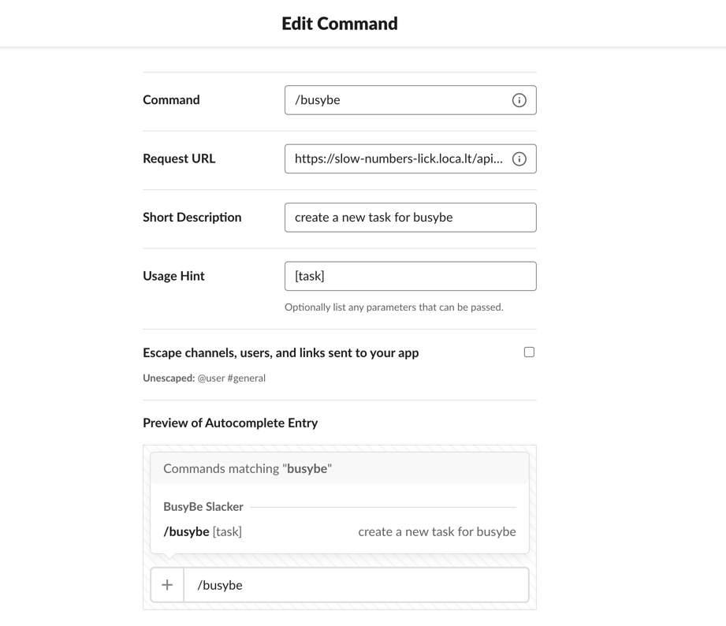

# How to debug slack integration locally


## Installation

```shell
npm install -g localtunnel
```

## Running local tunnel

```shell
lt --port 8080
```

command output should be (for example):

```commandline
your url is: https://spicy-pans-add.loca.lt
```

## Slack

Navigate to https://api.slack.com to **Slash Commands** tab

Append the API localtunnel address from the output command, for example:


